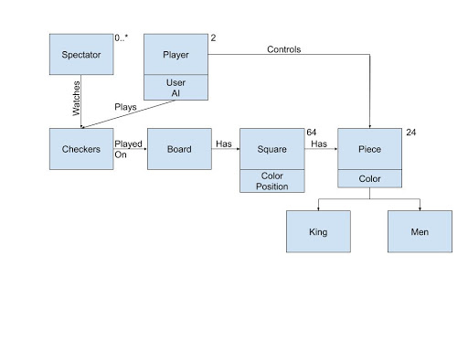
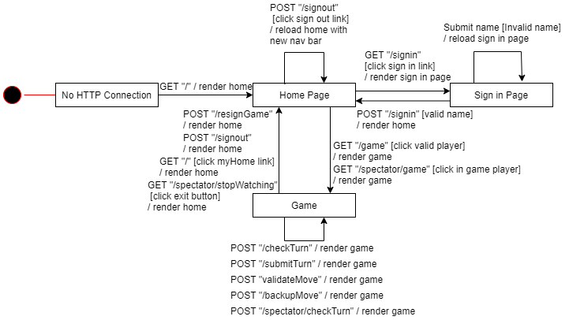
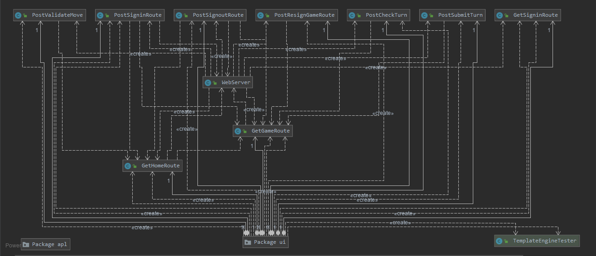

# PROJECT Design Documentation

## Team Information
* Team name: A Team
* Team members
  * Ryan Carnation
  * Tyler Bradley
  * Aryan Jha
  * Ryan Snyder

## Executive Summary

This project is a web application that will allow multiple users to play checkers with each other. The players will be able to sign in and out and challenge each other. They will use drag and drop mechanics to move their pieces and be the victor. The user may choose to play against another user that is signed in or challenge the computer. The user also has the choice to watch ongoing games.

### Purpose
For anyone of any age to be able to play online checkers.

### Glossary and Acronyms
| Term | Definition |
|------|------------|
| MVP | Minimum Viable Product |
| UI | User Interface |
| UML | Unified Modeling Language |
| HTML | HyperText Markup Language |
| CSS | Cascading Style Sheets |

## Requirements

This section describes the features of the application.

### Definition of MVP
The Minimum Viable Product is all of the stories required to be in the first product release. This is defined by the product owner and clearly identifies the set of stories that must be done before the product can be released.

### MVP Features
Every player must sign-in before playing a game, and be able to sign-out when finished playing. Two players must be able to play a game of checkers based upon the American rules. Either player of a game may choose to resign, at any point, which ends the game.

### Roadmap of Enhancements
We implemented an AI that the user may play against if they are feeling confident in their checkers skills. We also implemented the spectator mode where the user can watch two other players face off against each other. Each game can have unlimited spectators.

## Application Domain

The domain model shows that each checkers game always has 2 players while any number of spectators can watch. The checkers game is played on a board which has 64 squares each having a color and a position. Each square on the board may or may not have a piece at any given moment. Each piece has a color and can either be a king or a man. The players control these pieces when they play turn by turn. The user can choose to play against another user that is signed in or the computer. If there are no other available players, then the user can choose to spectate an ongoing game.

## Architecture and Design

This section describes the application architecture.

### Summary

The following Tiers/Layers model shows a high-level view of the webapp's architecture.

As a web application, the user interacts with the system using a
browser.  The client-side of the UI is composed of HTML pages with
some minimal CSS for styling the page.  There is also some JavaScript
that has been provided to the team by the architect.

The server-side tiers include the UI Tier that is composed of UI Controllers and Views.
Controllers are built using the Spark framework and View are built using the FreeMarker framework.  The Application and Model tiers are built using plain-old Java objects (POJOs).

Details of the components within these tiers are supplied below.

### Overview of User Interface

The user is first greeted with the home screen where they can see the number of players that are currently playing or they can sign in. Once they click the sign in link they are taken to another page where they must input a username. Once they input a valid username it will take them back to the home screen where they can now see the names of the current players and have the ability to sign out. The user can then click on any of the players names to challenge them as long as they are not already playing a game. If the player being challenged is currently busy playing, then the user will be able to spectate them as they play. The user can also choose to challenge the computer. Once they challenge another player or the computer they will be taken to the game screen where they will play. Each player always has the option to resign during the game or sign out which will also result in a resignation.

### Dynamic Operation

The above sequence diagram is showing the process of what happens after the user tries to sign in. The system starts by creating the HashMap that will be used for the view model. The title attribute is immediately put into the map because it will always need to be there. Next, the username that was inputed is gotten from the request that was passed into the handle method of this class. If the length of the username is greater than zero, it proceeds through more conditionals. If the length is zero then the invalid sign in attribute is added to the view and gets rendered. Once we know that it is longer than zero characters, we check if there is another player with that name, if there are special characters, or the name is just whitespace. If any of these are true, the invalid username attribute is added to the view and rendered. If none are true, the else statement gets invoked. This statement creates the new Player with the valid username. It sets the player's current state to waiting and redirects the user to the home page.

The above sequence diagram shows what happens when a player resigns from a game. The handle method starts by getting the session from the request that was passed into the method. The session is then used to get the current player. Using the gameLobby that the postResignGameRoute has, the current game is gotten using the name of the current player. The resign method is then called for the current game. A new Gson is then created. A new message is created showing that the resign was successful. The Gson is used to convert the new success message into a Json string and then returned.

### UI Tier
All of the routes are kept track of using the Webserver class, it creates and handles all of the routes. The intial loading of the page calls the GetHomeRoute which then renders the home page, if there are any players in the lobby then a message is displayed to show the number. From there the user can then choose to sign in. If they click the sign-in link then GetSigninRoute will be called and render the sign-in page. There the user can enter a name. One they enter a name and hit submit, then PostSigninRoute is called to get the name that they just entered. If the name is valid and no other player has it, then they will be sent back to the home screen with a new layout. If not, they have to enter a different name. Once they land on the home page, they are now able to see a list of all the other players and their names along with the AI that is always there. There they can click on a players name, if they are busy then the user will be registered as a spectator and be able to watch their game. Once a valid opponent is clicked GetGameRoute gets called and creates a game assigning colors depending on who challenged who. While playing, the GetGameRoute refreshes itself every five seconds to check if the player has made a move. When a player drags and drops their piece to make a move, PostValidateMove is then called. The move gets sent to the class and it decides if it is a valid move. If it is, then the user will get a message and they will be able to submit. If they suddenly decide that isn't the move they wanted to do, they can click backup which will call the PostBackupMoveRoute. This route will then get rid of the move that was just applied. While the user is sitting and contemplating their next move, PostCheckTurn/PostSpectatorCheckTurn is called to make sure that the right player is taking their turn. If the user is spectating and decides they no longer want to watch this game, they can click exit where the GetSpectatorStopWatching class will be invoked. This class is in charge of getting the spectator out of the game and back to the home screen. Once the user has decided on a move, they can click submit. Once clicked the PostSubmitTurnRoute will be called to apply the move to the board.

### Application Tier
The application tier of our project is the most basic tier. It houses the GameLobby and the PlayerLobby as well as the Message class. The GameLobby holds all of the games that are going on, its main job is to assign the right player colors and to handle what happens when a game ends or is resigned. This UML diagram shows its interactions with a Game: 

The other main class in the application tier is the PlayerLobby which holds all of the players that have signed in. The main purpose of this class is to retrieve and remove players and to check whether names have been taken already.

Lastly we have the message class which is used by the view to display either info or error messages.

### Model Tier

In this tier of the project we have all of our entities that are being used by the Checker game. To start it off we have the game itself which either directly or indirectly interacts with all of the lower level entities. The game houses the main board which is comprised of 8 rows each holding a set of 8 spaces creating an 8x8 Checkers board. Each space may or may not have a piece at any point in time depending on the state of the board. 

Next we have the different classes that are associated with the Player. The player class itself is fairly basic, holding the player's name, color, gameID of the game they are currently playing, and their current state. The state and color of the player are both enumerations. The color of the player can be either White or Red. The state can be Waiting, Ingame, or Challenge indicating that they have recently just been challenged by another player. The AI player inherits the Player class. It has all of the same fields and methods with a small addition. The AI player has a turn method that finds all of the valid moves they can make and chooses one at random. The AI player is able to prioritize jumps and multiple jump moves over simple moves.

Finally, we have the classes that are used to make the moves and validate them. The Move class represents each individual move which is comprised of two Positions, a start and an end. Each position only has a row and a cell. The MoveValidator class uses these two classes to generate possible moves and check if the inputed move is in that set of possible moves. If it is, then the piece is allowed to move, if not, then an error message is returned to let the user know.

### Design Improvements
We would improve the way that we handled creating the moves and checked whether the inputted moves were valid. There are many methods in one class that it is getting very cluttered and confusing to anyone that didn't write the code. The class is starting to violate the design principles which is also problematic.

## Testing

This section describes the testing of the application.

### Acceptance Testing
Almost all of our stories were able to pass their acceptance criteria tests, the only one that gives some issue is the spectator enhancement. If the user clicks on a player that is currently in a game with someone else, nothing happens. Once the user clicks on that player again, then they get put into the game with the role of the spectator. The spectator can't perform any moves and can only exit from the match when they no longer want to watch. This feature could also use some work, it sometimes throws an AJAX error when trying to exit. The spectator can see the moves in real time, it just takes a few seconds for the display to update with the most recent move. All of the other stories performed how they should have.

### Unit Testing and Code Coverage
Our unit testing strategy was to logically walk through the code, making sure that every conditional was getting executed. We were able to achieve a 88% code coverage. While this can be better, we are in a pretty good spot. With all of our main packages being 86% or above there wasn't a ton that was missed. THe UI and application tiers have the worst coverage compared to rest of the project. The classes that were added for the spectator enhancement are not being fully tested. There are a few conditionals in each route that are not being hit by the test classes. The board package inside of the model package also has one of the worst coverages. When inspecting a little further, the iterator were never used, but we never use them in the application either. Since they are only used for the html, it's not the end of the world that they aren't covered. Our coverage can be seen below: 

### Code Metrics
After we analyzed our code and its cyclomatic complexity, we were able to see the areas that needed a bit of work and what was actually doing pretty well. Looking at the class metrics, half of the classes that do not meet the target threshold are test classes or routes for the webserver. Since test classes are not used when the application is in use, we aren't too worried about improving them. The routes have no loops, but almost all of them have conditionals and multiple calls to other methods in other classes. There isn't too much that we can do to change that.

Looking a little further at the methods in each of the classes we can see that there are two main classes that need improvement. These would be AIPlayer and the MoveValidator. Many of the classes that are in the MoveValidator class have many conditionals to make sure that every piece, position, and space that is a part of every move is valid. There is a lot of redundancy in these methods that can be reduced. The AIPlayer only has one method and that is its turn() method. This method makes a lot of calls to other methods in other classes because it needs a lot of information that it doesn't hold.

